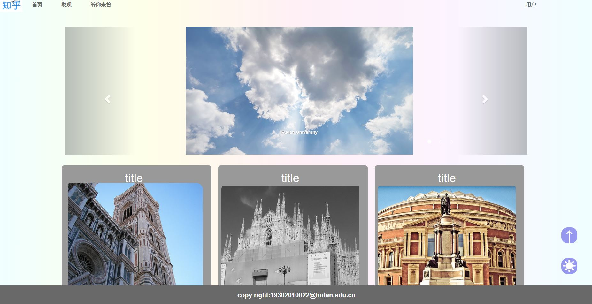

# Lab4设计文档

### 张稷平   19302010022

## 网页截图

## 布局

布局延续了lab3的风格，并在content中加入了滑动条（滑动条使用了bootstrap组件）

## 导航栏

导航栏延续了lab3的风格，在鼠标移动到某个条目上时条目的背景颜色会变成灰色，文字变成白色；移动到下拉菜单时，下拉菜单内容会显示；

## 配色

文字配色为透明底灰字，条目被鼠标移动到的时候文字会变成灰底白字；背景颜色为彩虹渐变色;回到顶部按钮为紫色半透明底白字，被鼠标移动到的时候会变成紫色不透明底白字

## 其它

变色时间为0.8秒，优化了视觉体验